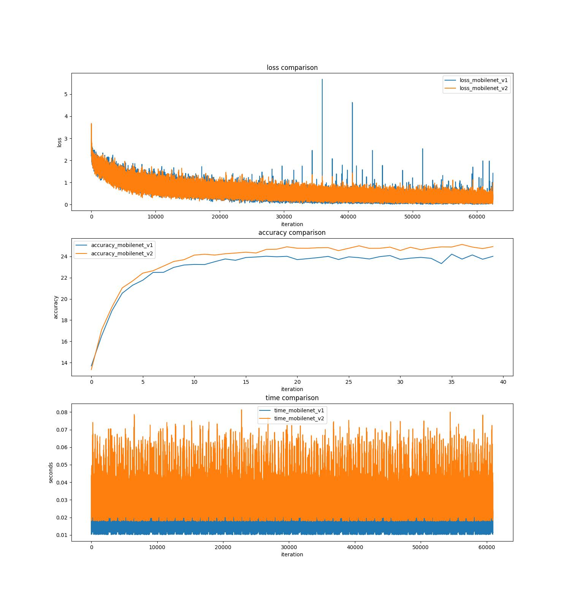

# mobilenetv2
---

### Purpose
- This repository is the 4th model implementation.
- The primary reason I bumped into this paper was, because while I was trying to implement `EfficientNet`, it used a CNN block used in `MobileNetV2`.


### Key Components
- Inverted Residuals and Linear Bottlenecks
  - The very key component of this paper, where bottleneck design is inverted
```python
class BottleneckResidualBlock(nn.Module):

    def __init__(self, first_channel, last_channel, factor, stride):
        super().__init__()
        self.stride = stride
        self.conv_1 = nn.Conv2d(in_channels=first_channel, out_channels=int(first_channel*factor), kernel_size=1, stride=1)

        # channel to be used in the block
        c = self.conv_1.out_channels
        self.bn_1 = nn.BatchNorm2d(c)

        self.conv_2_dw = nn.Conv2d(in_channels=c, out_channels=c, kernel_size=3, stride=stride, groups=c, padding=1)
        self.bn_2 = nn.BatchNorm2d(c)

        self.conv_2_pw = nn.Conv2d(in_channels=c, out_channels=last_channel, kernel_size=1)
        self.bn_3 = nn.BatchNorm2d(last_channel)
        self.last_channel = last_channel

    def forward(self, inputs):
        identity = nn.Identity()(inputs)
        x = F.relu6(self.bn_1(self.conv_1(inputs)))
        x = F.relu6(self.bn_2(self.conv_2_dw(x)))
        x = self.bn_3(self.conv_2_pw(x))

        if self.stride == 1 and identity.size() == x.size():
            x += identity
        return x
```

- MobileNet V2 model
  - I could have used `n`, `c`, `t` things in a config and used a lot of `for loops` like other implementations, but because my primary purpose was to build a model, I didn't want to complicate what could have been easier to read, so I kept the whole model structure simple as follows. 
```python
class MobileNetV2(nn.Module):
    def __init__(self, class_num):
        super().__init__()
        self.class_num = class_num
        self.layer_1_conv = nn.Conv2d(in_channels=3, out_channels=32, stride=2, kernel_size=3, padding=1)
        self.layer_2_bottleneck = BottleneckResidualBlock(first_channel=self.layer_1_conv.out_channels, last_channel=16, factor=1, stride=1)

        tmp_lst = []
        for i in range(2):
            if i == 0:
                tmp_lst.append(BottleneckResidualBlock(first_channel=self.layer_2_bottleneck.last_channel, last_channel=24, factor=6, stride=2))
            else:
                tmp_lst.append(BottleneckResidualBlock(first_channel=24, last_channel=24, factor=6, stride=1))
        self.layer_3_bottleneck = nn.Sequential(*tmp_lst)

        tmp_lst = []
        for i in range(3):
            if i == 0:
                tmp_lst.append(BottleneckResidualBlock(first_channel=self.layer_3_bottleneck[-1].last_channel, last_channel=32, factor=6, stride=2))
            else:
                tmp_lst.append(BottleneckResidualBlock(first_channel=32, last_channel=32, factor=6, stride=1))
        self.layer_4_bottleneck = nn.Sequential(*tmp_lst)

        tmp_lst = []
        for i in range(4):
            if i == 0:
                tmp_lst.append(BottleneckResidualBlock(first_channel=self.layer_4_bottleneck[-1].last_channel, last_channel=64, factor=6, stride=2))
            else:
                tmp_lst.append(BottleneckResidualBlock(first_channel=64, last_channel=64, factor=6, stride=1))
        self.layer_5_bottleneck = nn.Sequential(*tmp_lst)

        tmp_lst = []
        for i in range(3):
            if i == 0:
                tmp_lst.append(BottleneckResidualBlock(first_channel=self.layer_5_bottleneck[-1].last_channel, last_channel=96, factor=6, stride=1))
            else:
                tmp_lst.append(BottleneckResidualBlock(first_channel=96, last_channel=96, factor=6, stride=1))
        self.layer_6_bottleneck = nn.Sequential(*tmp_lst)

        tmp_lst = []
        for i in range(3):
            if i == 0:
                tmp_lst.append(BottleneckResidualBlock(first_channel=self.layer_6_bottleneck[-1].last_channel, last_channel=160, factor=6, stride=2))
            else:
                tmp_lst.append(BottleneckResidualBlock(first_channel=160, last_channel=160, factor=6, stride=1))
        self.layer_7_bottleneck = nn.Sequential(*tmp_lst)

        self.layer_8_conv = nn.Conv2d(in_channels=self.layer_7_bottleneck[-1].last_channel, out_channels=1280, stride=1, kernel_size=1, padding='same')
        self.layer_9_avp = nn.AdaptiveAvgPool2d(1)
        self.layer_10_conv = nn.Conv2d(in_channels=self.layer_8_conv.out_channels, out_channels=self.class_num, kernel_size=1, stride=1)

    def forward(self, x):
        x = self.layer_1_conv(x)
        x = self.layer_2_bottleneck(x)
        x = self.layer_3_bottleneck(x)
        x = self.layer_4_bottleneck(x)
        x = self.layer_5_bottleneck(x)
        x = self.layer_6_bottleneck(x)
        x = self.layer_7_bottleneck(x)
        x = self.layer_8_conv(x)
        x = self.layer_9_avp(x)
        x = self.layer_10_conv(x)
        B, C, H, W = x.size()
        x = x.view(B, int(C*H*W))
        return x

```

### Training Result


### References
- https://arxiv.org/pdf/1801.04381.pdf
  - got detailed explanations about the model
- https://www.youtube.com/watch?v=tVgUap_BPZw
  - got an intuition first
- https://www.youtube.com/watch?v=VdolZqdRAOg
  - verified the intuition in Korean